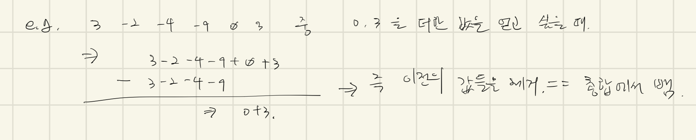

# [2559번: 수열](https://www.acmicpc.net/problem/2559)

## 시도

### 시도1(25632kb, 2544ms, Java11)

일단 되는지 먼저 확인하고 성능을 향상시키고 싶었다.

가장 먼저 떠오르는 생각은 당연히 `current ~ current + k` 까지의 인덱스를 모두 더하고,
최댓값을 계속해서 확인하는 방법이었다.

N이 최대 100,000이고, K는 최대 N이 나올 수 있기 때문에 시간 복잡도가 최대 O(N^2)을 생각하면,
10,000,000,000(백억)이지만, 일단 한 번 생각나는 대로 제출해봤더니 상당히 느리지만, 일단 정답.

```java
import java.io.BufferedReader;
import java.io.IOException;
import java.util.ArrayList;
import java.util.List;
import java.util.StringTokenizer;

public class Main {
    public static void main(String[] args) throws IOException {
        BufferedReader br = new BufferedReader(new java.io.InputStreamReader(System.in));
        StringTokenizer st = new StringTokenizer(br.readLine());
        int n = Integer.parseInt(st.nextToken());
        int k = Integer.parseInt(st.nextToken());
        List<Integer> numbers = new ArrayList<>();
        new StringTokenizer(br.readLine()).asIterator().forEachRemaining(val -> numbers.add(Integer.parseInt((String) val)));

        int answer = Integer.MIN_VALUE;
        for (int i = 0; i < n - k + 1; i++) {
            int result = 0;
            for (int j = i; j < i + k; j++) {
                result += numbers.get(j);
            }
            answer = Math.max(answer, result);
        }

        System.out.println(answer);
    }
}
```

### 시도2(24088kb, 244ms, Java11)

[AndroidTeacher](https://hongcoding.tistory.com/160)님의 블로그를 참고한 코드이다.

블로그에서 설명하는 건 

`current ~ current + K`까지의 값을 구하는 건 `current ~ K`까지 구한 값에서 `0 ~ current`의 값을 빼주면 된다고 했다.



와 같은 느낌

세상엔 똑똑한 사람들이 많다.

코드로 구현 !

```java
import java.io.BufferedReader;
import java.io.IOException;
import java.util.StringTokenizer;

public class Main {
    public static void main(String[] args) throws IOException {
        BufferedReader br = new BufferedReader(new java.io.InputStreamReader(System.in));
        StringTokenizer st = new StringTokenizer(br.readLine());
        int n = Integer.parseInt(st.nextToken());
        int k = Integer.parseInt(st.nextToken());
        st = new StringTokenizer(br.readLine());

        int[] repository = new int[n];

        repository[0] = Integer.parseInt(st.nextToken());
        for (int i = 1; i < n; i++) {
            repository[i] = repository[i - 1] + Integer.parseInt(st.nextToken());
        }

        int answer = repository[k - 1];
        for (int i = k; i < n; i++) {
            answer = Math.max(answer, repository[i] - repository[i - k]);
        }

        System.out.println(answer);
    }
}
```
