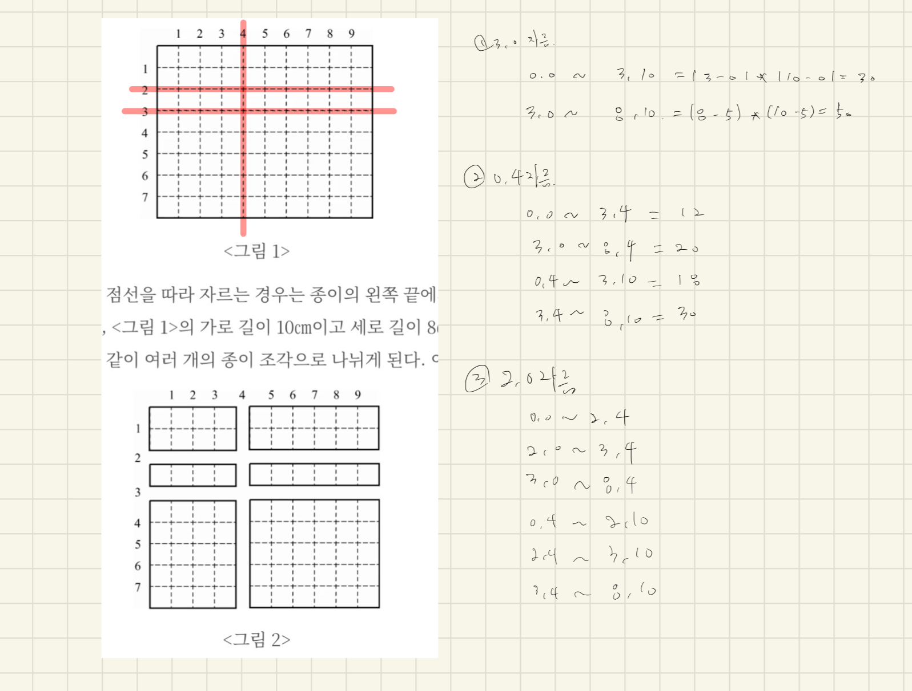

# [2628번: 종이자르기](https://www.acmicpc.net/problem/2628)

## 시도

### 시도1(14236kb, 112ms, Java11)

그래프를 잘게 쪼개는 건 처음 접해보는 문제인 것 같다.

현재 난이도가 실버5라고 측정되어 있지만, 이런 유형을 처음 보는 나는 실버 상위 수준으로 느낌,,(다양한 문제를 공부하자)



위 사진처럼 직접 그려보면서 나눠지는 좌표들을 직접 작성해가며 접근해봤다.

한 줄씩 추가될 때 마다 발견되는 규칙들이 있지만, 어떻게 접근을 해야 할 지 모르겠어서
일단 아래와 같이 코드를 작성해 놓아봤다.

```java
List<Integer> row = new ArrayList<>(List.of(0, r));
List<Integer> col = new ArrayList<>(List.of(0, c));

// ...

List<Integer> row = new ArrayList<>(List.of(0, 2, 3, r));
List<Integer> col = new ArrayList<>(List.of(0, 4, c));
```

위 상태에서 계산 또는 접근하는 방법을 찾으면 문제를 풀 수 있을 것 같은데 마땅한 아이디어가 생각나질 않았고,
밤이 늦어서 얼른 집에 가고 싶은 마음에(피곤하진 않지만, 밤 낮이 너무 바껴있어서 고쳐야함,,) 아래 블로그를 참고하여 문제를 해결했다.

[one2ye](https://ye5ni.tistory.com/30)님의 블로그를 참고하였다.

너비를 구하기 위해서는 그냥 단순히 앞의 인덱스에서 뒤에 인덱스를 빼고 가로와 세로 높이를 계산하면 되는 거였다..

해결한 코드

```java
import java.io.BufferedReader;
import java.io.IOException;
import java.util.ArrayList;
import java.util.List;
import java.util.StringTokenizer;

public class Main {
    public static void main(String[] args) throws IOException {
        BufferedReader br = new BufferedReader(new java.io.InputStreamReader(System.in));
        StringTokenizer st = new StringTokenizer(br.readLine());

        int c = Integer.parseInt(st.nextToken());
        int r = Integer.parseInt(st.nextToken());
        List<Integer> row = new ArrayList<>(List.of(0, r));
        List<Integer> col = new ArrayList<>(List.of(0, c));

        int n = Integer.parseInt(br.readLine());
        for (int i = 0; i < n; i++) {
            st = new StringTokenizer(br.readLine());
            String type = st.nextToken();
            if (type.equals("0")) {
                row.add(Integer.parseInt(st.nextToken()));
            } else {
                col.add(Integer.parseInt(st.nextToken()));
            }
        }

        row.sort(Integer::compareTo);
        col.sort(Integer::compareTo);

        int answer = -1;
        for (int i = 0; i < row.size() - 1; i++) {
            for (int j = 0; j < col.size() - 1; j++) {
                answer = Math.max(answer, (row.get(i + 1) - row.get(i)) * (col.get(j + 1) - col.get(j)));
            }
        }

        System.out.println(answer);
        br.close();
    }
}
```